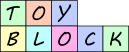

========
TOYBLOCK
========

Toyblock is yet another entity component system written in pure Python
being fast as possible.

Installation
------------

::

    pip install toyblock

API
---

*toyblock.Entity*
.................

It's just a bag for components to be used with *toyblock.System*.

- *toyblock.Entity([_instance_, ...])*
- *toyblock.Entity.add_component(_instance_)*
- *toyblock.Entity.get_component(_type_of_instance_)* **Deprecated**
- *toyblock.Entity[_type_of_instance_]*
- *toyblock.Entity.del_component(_type_of_instance_)*
- *toyblock.Entity.free()*
- *toyblock.Entity.pool*

*toyblock.System*
.................

Define the system behavior with *callable_*.

*callable_* signature is *(system, entity, *args, **kwargs)*

First you add entities to a system, then you call the system,
passing any number of variables to the callable.

- *toyblock.System(callable_)*
- *toyblock.System.add_entity(entity)*
- *toyblock.System.remove_entity(entity)*
- *toyblock.System.__call__(\*args, \*\*kwargs)*
- *toyblock.System.__contains__(entity)*
- *toyblock.System.__len__()*

@toyblock.system
++++++++++++++++

Toyblock provides you a convenient decorator for building a System

::

    @toyblock.system
    def a_system(system, entity):
        # do stuff

    a_system.add_entity(a_entity)
    a_system() # Run the system

*toyblock.Pool*
...............

A pool of entities that helps you to cache the entities and manage them automatically.
You provide args and kwargs for each one of the entity's component. You can add
systems which entities will be added or removed from them automatically when a
entity is freed.

- *toyblock.Pool(number_of_entities, [type_list], [args_list], [system_list])*
- *toyblock.Pool.get()*
- *toyblock.Pool.free(_entity_)* **Deprecated**

Pool example
++++++++++++

::

    arguments = (
        ((32, 32), {"visible": False}),
        ((640,), None),
        # You can omit arguments for the third class or just None
    )

    my_pool = toyblock.Pool(100, (Body, Jump, Graphics), arguments)
    # You can omit 'arguments' too if the classes do not need any.
    a_entity = my_pool.get()
    my_pool.free(a_entity)

Example usage
-------------

::

    from time import time
    import toyblock

    #Our components for the entity
    class A:
        def __init__(self):
            self.x = 1

    class B:
        def __init__(self):
            self.b = 0

    entity = toyblock.Entity(A(), B()) #The order does not matter

    def multiply_with_time(system, entity, current_time):
        """This will be the callable for our system."""

        b = entity.get_component(B)
        a = entity.get_component(A)
        b.b = a.x*2*current_time
        if b.b > 3:
            system.remove_entity(entity)

    main_system = toyblock.System(multiply_with_time)
    main_system.add_entity(entity)
    main_system(time()) #Run, or call, the system

Run tests
---------

At the project's root

::

    python -m unittest

License
-------

..  image:: https://www.gnu.org/graphics/lgplv3-147x51.png
    :alt: LGPL-3.0
